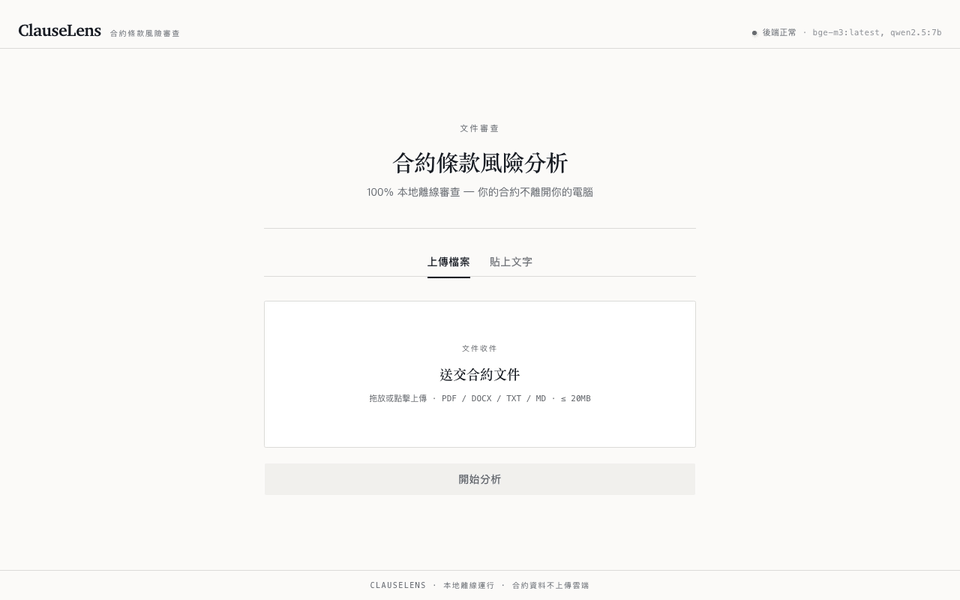
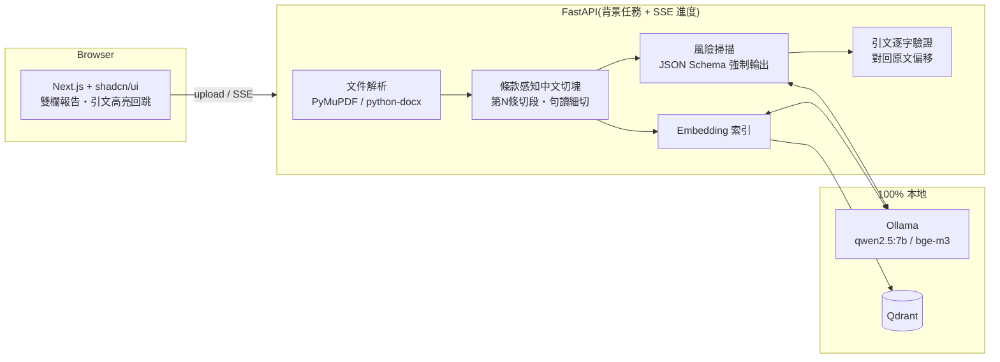

# ClauseLens 📜🔍

> **第一個真正本地、繁中優先的開源合約風險審查器**
> 100% 離線運行 — 你的合約永遠不離開你的電腦。

[](https://github.com/yusyuan9224/clauselens/actions)
[](LICENSE)
[](backend/pyproject.toml)
[](https://ollama.com)



## 為什麼需要 ClauseLens?

收到一份合約 — 租約、勞動契約、外包協議 — 你**不敢把它上傳到 ChatGPT**(機密外洩風險),自己又看不懂哪些條款有坑。市面上的合約審查工具不是要付費上雲,就是英文/企業導向。

**ClauseLens 完全在你的電腦上運行**:本地 LLM(Ollama + Qwen2.5)、本地 embedding(bge-m3)、本地向量庫(Qdrant)。零 API 費用、零資料外流。

## 核心功能

- 📄 **上傳合約**(PDF / Word / 純文字)→ 本地解析、條款感知切塊、向量化
- ⚠️ **自動標出風險條款**:自動續約、高額違約金、競業禁止、不利終止條件、模糊條款、單方變更權
- 🗂️ **關鍵欄位結構化抽取**:雙方當事人、標的、金額、起訖日、終止條件
- 🔗 **每個結論附原文出處**:引文逐字驗證對回原文,點擊風險卡片即捲動至合約原文高亮處 — **驗證失敗的引文會被明確標記,風險分數只計入驗證成功者**(防幻覺)
- 📊 **風險評分總覽**(0–100)+ JSON 報告匯出

## 快速開始

**前置需求**:[Docker](https://docs.docker.com/get-docker/) 與 [Ollama](https://ollama.com)(Ollama 跑在主機上才能使用 GPU / Apple Metal 加速)。

```bash
# 1. 下載模型(一次性,約 6GB)
ollama pull qwen2.5:7b && ollama pull bge-m3

# 2. 一鍵啟動
git clone https://github.com/yusyuan9224/clauselens.git
cd clauselens
docker compose up --build
```

開啟 **http://localhost:3000**,把 `examples/` 裡的範例合約拖進去試試。

<details>
<summary>不用 Docker 的本機開發模式</summary>

```bash
# 後端(需要 uv)
cd backend
uv sync
uv run clauselens doctor                  # 檢查 Ollama 與模型
uv run uvicorn clauselens.server:app --port 8000 --reload

# 前端(另一個終端機,需要 Node 22 + pnpm)
cd frontend
pnpm install && pnpm dev
```

也可以直接用 CLI,不開網頁:

```bash
cd backend
uv run clauselens analyze ../examples/房屋租賃契約_範例.txt
```

</details>

## 架構



## 技術決策(為什麼這樣設計)

| 問題 | 決策 | 理由 |
|------|------|------|
| 本地 7B 模型輸出 JSON 不穩 | Ollama `format=` JSON Schema + Pydantic 驗證 + 把驗證錯誤回饋給模型重試 | 實測對 qwen2.5:7b 結構化輸出穩定可用 |
| LLM 引文幻覺 | 引文必須逐字對回原文(精確比對 + 容忍空白差異的模糊比對),失敗者標記且不計分 | 把「來源回溯」做成可驗證的機制,而非裝飾 |
| 中文合約沒有空格、通用 splitter 切碎條款 | 以「第 N 條」為語義單位切塊,超長條款再按句讀細切,全程保留字元偏移 | 條款是合約的自然語義邊界;偏移使高亮回跳精確 |
| Docker 內跑 LLM 沒有 GPU | Ollama 留在主機,容器經 `host.docker.internal` 連線 | Apple Silicon / NVIDIA 都能吃到加速 |
| Embedding 用 sentence-transformers 還是 Ollama | Ollama 跑 bge-m3 | 後端映像不含 torch,體積小一個數量級 |

## 評測

`backend/evals/` 內含三份標註過的合約測試集(租賃、勞動、外包),量測風險召回率與引文驗證率:

```bash
cd backend && uv run python evals/run_eval.py
```

## 專案結構

```
clauselens/
├── backend/          # FastAPI + 分析管線(uv / Python 3.12)
│   ├── src/clauselens/
│   │   ├── parsing.py      # PDF/DOCX/TXT → 全文 + 頁碼偏移
│   │   ├── chunking.py     # 條款感知中文切塊
│   │   ├── ollama_client.py# 結構化輸出 + 重試
│   │   ├── analyzer.py     # 管線編排 + 引文驗證
│   │   ├── server.py       # REST + SSE
│   │   └── cli.py
│   ├── tests/              # 單元測試(不需 Ollama)
│   └── evals/              # LLM 評測集(需 Ollama)
├── frontend/         # Next.js App Router + Tailwind + shadcn/ui
├── examples/         # 範例合約(風險條款已刻意設計)
└── docker-compose.yml
```

## 限制與聲明

- ClauseLens 是輔助工具,**不構成法律意見**;重要合約請諮詢律師。
- 7B 本地模型可能漏報或誤報,引文驗證機制能防幻覺、但防不了漏看。
- 目前以繁體中文合約為最佳化目標;英文合約可用但未調校。

## 貢獻

歡迎 PR!請見 [CONTRIBUTING.md](CONTRIBUTING.md),新手友善任務標在 [`good first issue`](https://github.com/yusyuan9224/clauselens/issues?q=label%3A%22good+first+issue%22)。

## License

[MIT](LICENSE)
